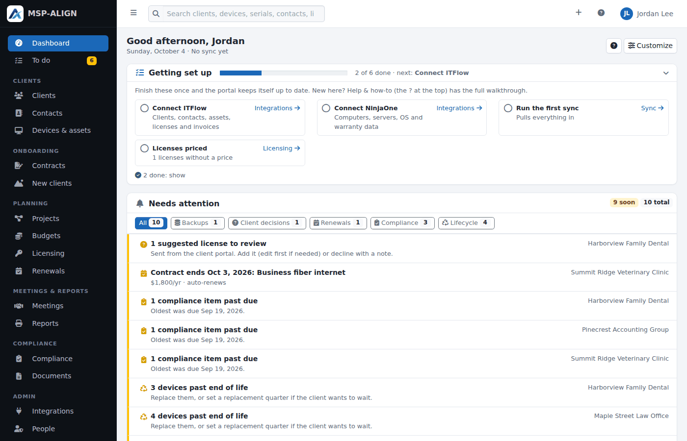

# MSP-ALIGN

Self-hosted, open-source vCIO toolkit for managed service providers. It brings in clients and assets from **ITFlow** (or works without a PSA: clients come from your RMM, a CSV import or are added by hand), devices from **NinjaOne** and backups from **Veeam Service Provider Console**, looks up Dell and Lenovo warranties, and shows each client's lifecycle position: what's out of warranty, what's past its replacement date, which operating systems are losing support, and what replacements will cost quarter by quarter. On top of that: roadmaps and budgets, licensing and renewals, compliance frameworks, QBR reports, a client portal, email through Microsoft 365, Google Workspace or SMTP, and a [REST API](docs/API.md). Free under the AGPL; your client data stays on your server.



More in [Screenshots](docs/SCREENSHOTS.md): clients, the roadmap, the budget, compliance, reports and the client portal.

> **Formerly Mountaineer Align (renamed in 1.24).** Everything is MSP-ALIGN, including, since 1.35, the folders, services and logs on the server (`/opt/msp-align`, `/etc/msp-align`, `msp-align-*`). Servers installed earlier move on their next update, and the old `mountaineer-align` folder names and commands keep working as links.

## What's new

- **Ready to start: tickets when the work is due (2.2.2):** approve a whole year of projects without filling your PSA's ticket board. Each project gets one **QUOTE-** ticket, made only when you say so.
  - **Ready to start:** an approved or scheduled project with no ticket goes on **To do** (new **Projects** tab) on the first day of its quarter, and stays there while it's overdue. **Ready to start** shows what goes into the ticket (subject, devices or description, quarter and budget) before it's made; **Ready to start: all** does every project on the list at once. It also works any time from the project window and the new **Ticket** column on Projects.
  - **Not yet:** hides a project from To do for a month, or 2, 3 or 6 months from its menu. The project shows when it comes back.
  - **Without a ticket:** with no PSA connected, or for a client that isn't linked to the PSA, projects still go on To do when their quarter starts, and **Ready to start** marks the project started (the date and who, saved on the project and in the audit log) instead of making a ticket. A project started that way can get its ticket later from the project window or Projects page, once one can be made (it keeps who started it and when), and **Not started** in the project window undoes the mark. If the client is linked or unlinked while a Ready to start window is open, pressing it does nothing and says to reload, so a project meant to get a ticket is never just marked started (or the other way round). The column and filter on Projects say **Started** when there's no PSA. The API's projects have a new `started_at`.
  - **On a test server** (`'staging' => true`): Ready to start works as it would for real, but saves a pretend ticket number (`TEST-` and the project's number) and sends nothing to the PSA, so the whole flow can be tried on a copy of real data.
  - **Making projects:** **Make projects** and **Add project** no longer make a ticket unless you tick **Make the QUOTE- ticket now**. Projects added by hand work exactly like device projects. Projects that already have a ticket keep it.
  - **After updating:** approved or scheduled projects from this quarter or earlier that have no ticket show on To do right away, older hand-added ones too (and, new, the ones of clients not linked to the PSA, or every client's without a PSA). Mark the finished ones **Done** and they leave the list.
  - **Also:** purple and teal category labels (Software / licensing, Cloud / M365, some meeting, license and document kinds) had white text on no background and are readable again.
- **More device filters (2.2.2):** **Devices & assets** (every client's list and each client's) has a **Filters** button. Its panel narrows the list by make and model, operating system, age, replacement year, warranty, status, backup, location, whether the device is in a project, and whether it has a last user. Each choice shows how many devices it has.
  - Filters work together with the view tabs, **Type**, the client picker and the search. Active filters show as chips above the list; press one to remove it, or **Clear all**.
  - The filters are part of the page address, so a filtered list can be bookmarked or sent to a colleague. **CSV** downloads just the filtered devices, and **Set replacement** comes back to the same filtered list.
- **Security and quality review (2.2.1):** every file of Align was read line by line, then a separate security audit checked the whole program, and everything found was fixed and tested. [Security](docs/SECURITY.md#security-audit-221) has the summary. What you may notice:
  - **Sign-in:** wrong two-factor codes after a correct password alert admins at 5 in a row. After 50, the password is replaced and that person's sessions end, because someone else probably knows it. A password change, 2FA change or *Sign out everywhere* also turns off that person's calendar feed link; make a new one on the Meetings page.
  - **Integrations:** connections use `https://` only, don't follow redirects and never reach the server itself or cloud metadata addresses. Servers on your own network work as before. An integration installed on the same machine needs `'allow_local_integrations' => true` in `config.php`. If Veeam's list of protected machines can't be read, the machines from the last sync are kept.
  - **Contracts:** editing a draft you already signed removes your signature, so you sign again. A contract the client signed counts as signed even after it's cancelled, so only an admin can delete it. Only an admin can link the contract of a deleted client again. A drawn signature needs visible ink.
  - **Onboarding:** only admins can remove an onboarding, finishing needs every step done, and the welcome page can save contacts 30 times a day.
  - **Settings:** the company email on Settings → General is checked only when you change it. The email settings form is checked as a whole before anything is saved. An interrupted backup download keeps the backup on the server, so you can try again within the hour.
  - **Audit log:** more is recorded: views of the contract and document lists, portal users and unassigned hardware, every visit to an onboarding page, PSA checks that only changed contacts or licenses, **Sync now** on a device, and which records a CSV import changed.
  - **Docker:** `ALIGN_STAGING` also accepts `true`, `yes` or `on`, and any other value stops the start-up. Scheduled jobs have time limits. The image now includes the release key file, so the update notice only offers signed releases.
- **Contracts, signed online (2.2):** send your own contracts to be signed online, and keep the signed copies with the client. They're under **Onboarding** in the menu, with the welcome email and the onboarding guide (moved from Settings).
  - **Your own agreement:** upload it as a PDF and Align keeps it exactly as it is. Place boxes on it for the client's details, the contract start date, your prices (quantities counted from the client's devices, users and licenses), signatures, names, titles, dates and initials. **Find the blanks** suggests them for you. Or write the contract in Align instead.
  - **Send and sign:** make a contract for a client or a new lead, check the preview and send it. The client opens a private link (with a code emailed to them, if you turn that on) and is taken box by box through filling in, initialing and signing, or declines. Reminders go out automatically.
  - **The signed copy:** after you countersign, Align makes the signed PDF with a signature certificate (who signed, when, from which IP address and browser, and a fingerprint of the content), keeps it with the client and emails a copy. **Check a signed PDF** tells you whether a copy someone sends you is exactly the signed one.
  - **Also:** keep contracts signed elsewhere (DocuSeal or paper) by uploading them, and turn a new lead into a client in one click, ready for the welcome email. **New clients** lists every onboarding.
- **Sign-in backgrounds (2.1.1):** the sign-in pages now have a background: a built-in dusk landscape for your team and a calm, light one for the client portal. Under Settings → Branding you can upload your own for each (JPG, PNG or WebP up to 8 MB), choose how much to darken it, or pick **No image** for the plain page. The logo and the sign-in box stay readable on any photo, on desktop and phones, in light and dark mode. Images are re-encoded before they're shown, so no camera or location details go out with them.
- **Replacements become projects, with a quote ticket (2.1):** when a client approves replacing devices, tick them on the client's **Devices & assets** page (or open one device) and choose **Make projects**. You get one project per device, or one for several replaced together, in their replacement quarter or one you pick, at their budgeted cost or the quote amount. Align can also create a **QUOTE-** ticket in ITFlow for each one, listing the devices, serials, users and budget, with no client contact so it's simply a new ticket to assign. The devices leave the automatic replacement plan while the project stands, so the roadmap and budget never count them twice; decline or delete the project and they go back to their replacement dates. Each device links to its project, and the project lists its devices and ticket.
- **Microsoft 365: old backups kept are no longer counted (2.0.2):** Veeam keeps the backups of people who left and of tenants no longer used, and lists them for years. A user, group, team or site with no new backup for 30 days now moves to a **No longer backed up** list on the client's Backups page (old backups kept, still restorable) and isn't counted as protected or overdue anywhere, including reports and the client list. Until then a stopped backup still shows as overdue. Change the days, or turn this off with 0, under Integrations → Veeam. A tenant whose last backup Veeam doesn't report now shows its newest restore point instead of "never".
- **Microsoft 365 backups in two repositories (2.0.1):** when a tenant's backups moved from a legacy repository to a new one, Veeam lists each user, group, team and site once per repository, and Align could keep the legacy copy (months old) and show a current mailbox as overdue. Now the copies are one object and the newest restore point counts. The Backups page shows **days with a backup** for each one (several restore points on one day count once, across repositories), marks objects kept in more than one repository, and lists every protected user, group, team and site, not only the overdue ones. Align counts the days from its first sync after the update, since Veeam reports each repository's newest restore point rather than every date.
- **"Are you sure?" before big changes (2.0.1):** changes that are wide, hard to undo, email clients or write to your PSA now ask first, in a dialog in the app's own style (light or dark) that says what will happen and to how many, e.g. *"Change the replacement plan for 14 devices? Their place on the roadmap and in the budget moves with it."* It only asks when it matters: saving the lifecycle policy asks only when a lifespan or cost changed, and says how many devices are recalculated.
  - **Wide changes:** bulk replacement plans and device types, the lifecycle policy, budget year and OS support dates, client mapping and hosted-backup moves, deleting framework controls (with how many clients lose their answers), turning off the API, client suggestions or online requests, and staff role changes (Cancel puts the old role back).
  - **Emails to clients:** meeting invitations and updates (and whole series), welcome emails, new portal invite and reset links, digests sent now, documents shared to the portal, and client emails being switched on.
  - **Writes to the PSA:** turning on two-way sync, asset creation or warranty write-back, bulk type changes sent to the PSA, syncing a device again and restoring a retired one.
  - **Unsaved changes:** closing an edit window (project, budget line, license, contact, device, meeting, portal user) with changes asks before discarding them, and leaving a long form (compliance checklist, framework editor, mapping, settings, integrations) asks before the page closes.
  - **Enter is safe:** pressing Enter in a field saves the form; it no longer runs a Delete, Retire, Restore or "new link" button that happened to come first.
- **MSP-ALIGN 2.0: ready for everyone (2.0.0).** The first public release: everything from 1.27 to 1.45 (REST API, no-PSA mode, setup wizard, demo data, the new look and dark mode, Docker, the security audit) is now the base for other MSPs to install. New in 2.0:
  - **Signed releases:** a server installs only releases signed with the MSP-ALIGN release key, which is never stored on GitHub or a build machine, and checks the signature itself against the key file it already has. A release that isn't signed with it is refused and raises a security alert, so a stolen GitHub account can't push an update to your server. Settings → Updates & backups shows the key's fingerprint. Docker images are signed too. See [Signed releases](docs/RELEASING.md).
  - **API: PSA ids are text.** `psa_id` (clients, contacts, licenses) and `psa_asset_id` (devices) are now always text, for example `"57"`, so every PSA fits the same field. **If an integration compares `psa_id` with a number, update it** or use the `itflow_*` fields, which stay numbers. From 2.0, the v1 API only adds things; anything that would break an integration will come as v2. See [REST API](docs/API.md).
  - **Docs:** new pages for the [REST API](docs/API.md) (every endpoint, generated from the API itself), [Troubleshooting](docs/TROUBLESHOOTING.md), the [FAQ](docs/FAQ.md) and [Contributing](CONTRIBUTING.md), fresh screenshots, and corrected install and Docker steps.
  - **For contributors:** a [code of conduct](CODE_OF_CONDUCT.md), issue and pull request templates, sign-off on commits (DCO) and GitHub Discussions for questions.
  - **Also:** `sudo msp-align-update` with nothing new installs the current release again, which repairs packages, permissions and services. A restore no longer sets off a false audit log alert at the next nightly check. A Docker container can be a test server (`ALIGN_STAGING`). The installer waits for a backup or update that's running instead of overlapping it.
- **Branding page in the new look (1.45.2):** Settings → Branding now matches the 1.43 interface: cards for name & logo, colors (suggested colors, and dark or light menu as picture choices) and the sign-in page message. The live preview shows the app, the staff sign-in page and the client portal as they look now, in light or dark mode, and follows every change as you type. Nothing else about branding changes, and your settings are kept.
- **Remember this browser, and yearly invoices (1.45.1):**
  - **Remember this browser:** after the two-factor code, staff and client-portal users can tick *Remember this browser* to skip the code on that browser for 14 days. Their password is still asked for at every sign-in. Admins set the number of days, or turn it off, under Settings → General → Security. Each person sees and can forget their remembered browsers on their Account page, and a password or authenticator change, *Sign out everywhere*, a 2FA reset or disabling the account forgets them all.
  - **Yearly recurring invoices:** the managed-services estimate from ITFlow now follows each recurring invoice's own frequency. A yearly one counts as a twelfth a month instead of the whole amount every month. ITFlow's API doesn't say how often a recurring invoice repeats, so each one's frequency is worked out from the dates of the invoices it made. One billed only once counts as yearly until a second invoice shows it's monthly, and one that stopped billing drops out. The budget line says how it was worked out, e.g. "1 monthly, 1 yearly".
- **Security audit (1.45):** before 2.0, every file of the app, installer, backup agent and Docker setup was reviewed line by line and tested against a live install; [Security](docs/SECURITY.md#security-audit-145) has the summary.
  - **Serious fix:** with code already running as the web user, the root backup agent (and the installer and Docker start-up) could be tricked by a symlink into handing a root-owned folder to the web user. The agent now does everything in the web user's folders as that user.
  - **The audit log:** its start and end are sealed too, and the nightly check keeps an outside checkpoint, so entries cut off either end, or an old copy written back, are caught.
  - **Portal:**
    - The QBR's key contacts and next meeting need the contacts permission.
    - A reset link on a 2FA account asks for the code before anything changes.
    - Service requests are rate limited.
  - **Sign-in and 2FA:**
    - Removing someone's 2FA also gives them a one-time password.
    - Moving 2FA to a new phone needs a code from the old one.
    - Lockouts and one-time codes hold up against parallel requests.
  - **Integrations and email:** changing an integration's address or the SMTP server needs the key or password typed again.
  - **API:** client-limited keys can't reword or cancel a meeting whose invitations went out, and a key stops when its creator is no longer an admin.
  - **More in the audit log:** scheduled syncs, PSA changes, document autosaves, license restores, meeting notes and views of device lists, compliance and contacts.
  - **Also:**
    - Brand logos are re-encoded.
    - Only admins can delete a document.
    - Onboarding links end a week after onboarding is done.
    - GitHub Actions are pinned to exact commits, with Dependabot watching them and the Docker images.
- **Contacts sync both ways with ITFlow, archiving too (1.44.1):** archiving or restoring a contact in Align now does the same in ITFlow (ITFlow's own archive, so it also clears the contact's Important/Billing/Technical flags and archives their client-portal login there); a contact archived in ITFlow comes back in Align when it's restored there. Each client's Contacts page says whether its contacts sync both ways, come in only, or stay in Align (not linked, with a link to Client mapping), and the Integrations switch is now called *Two-way sync (devices and contacts)*. If ITFlow refuses, or is too old to archive from other apps, Align says so and archives in Align only.
- **Install with Docker (1.44):** MSP-ALIGN also ships as a container image (`ghcr.io/msp-align/msp-align`, amd64 and arm64) with a `compose.yaml` for the app and MariaDB and an optional `compose.caddy.yaml` for automatic HTTPS. One container runs the web app, the scheduled jobs and the backup agent; data lives in named volumes. Backups and restore work from Settings as before, and a backup moves between Docker and a dedicated server. Updates in Docker are `docker compose pull && docker compose up -d`. In Docker, trusted proxies can be narrow address ranges, and the database is encrypted at rest as on a dedicated server. Dedicated installs are unchanged, and CI now proves it: every change runs a fresh `install.sh` and an update from the previous release in a Debian 13 VM. See [Install with Docker](docs/DOCKER.md). The docs site has a new [Screenshots](docs/SCREENSHOTS.md) page, and the docs are brought up to date with the 1.42 menus and 1.43 look.
- **A cleaner look, and dark mode (1.43):** the interface moves to AdminLTE 4 and Bootstrap 5.3 with a cleaner design: white cards on a light gray page, softer borders and badges, one accent color (your brand color from Settings → Branding) and a compact dark sidebar. Each person picks **Light**, **Dark** or **Match my computer** under **Account → Light or dark**; printed reports and PDFs always stay light. The client portal gets a friendlier look: the client's logo and name at the top, larger text, more white space and simpler section tabs. jQuery is no longer used.
- **Faster at scale, and one layout (1.42):** tested at 150 clients and 10,000 devices, where every page now loads in under a second. The hourly sync takes half as long, the 2-minute PSA check and the digest emails a quarter to a half, and the Licensing, Contacts, Projects and Client mapping pages send a tenth of the HTML (edit forms load when opened). The main menu is shorter: a new **To do** list (hardware to categorize, licenses to price, clients to link, hosted backups to match, client suggestions), a **Devices & assets** list across every client, and Admin pages with tabs (Integrations: connections, client mapping, hosted backups, sync history; People: staff and portal users). The top search also finds devices by name, serial or user, contacts and licenses. Client menus are grouped (Their IT · The plan · Meetings, with a Reports page), every list has the same header, tiles and one-row filter bar with 100 rows at a time and search over every row, the device table shows 7 columns with a Columns menu, device pages have tabs, and the client portal has six tabs instead of ten. The installer now sets PHP's memory limit to 512 MB and sizes the MariaDB buffer pool to a quarter of RAM; `tests/perf/` builds a large test install and times every page.
- **Demo data (1.41):** try MSP-ALIGN before adding your own clients: on an install with no clients, **Load demo data** (setup wizard → Clients, or Settings → General → Demo data) adds four made-up clients with contacts, devices of every age (some past end of life or on an unsupported OS), licenses, budget lines and contracts, roadmap projects, meetings, a compliance assessment, documents, 30 days of backup results, a client portal user and a license suggestion waiting for review. Dates are relative to the day it's loaded. A banner shows while it's there, and **Remove demo data** deletes exactly the demo clients and everything attached to them. Names, email addresses (.example) and serial numbers are invented; service levels are left out because they come from a PSA.
- **Setup wizard (1.40):** a new install opens a step-by-step wizard for the first admin: company details, logo and colour; currency, dates and timezone; PSA (ITFlow or none); RMM; backups and warranty lookups; email (Microsoft 365, Google Workspace or SMTP); first clients (first sync, RMM organizations, CSV import or by hand); and staff accounts. Every step can be skipped and shows as skipped; steps done elsewhere are ticked too. The forms are the app's own settings, integration, email and user forms, so nothing is saved differently. Existing installs are marked as set up when they update and never see it pop up; any admin can open it from Settings → General.
- **Client portal update (1.39):** clients can suggest licenses (product, vendor, how many, price, billing, renewal date) and budget items (internet, phones, hosting, other costs) from the portal. Each waits for staff: it shows on the dashboard and at the top of the client's Licensing or Budget page, where **Review and add** opens the normal Add form filled in from the suggestion (edit anything first) and **Decline** takes a note. The client sees it as waiting, added or declined (with the note) and can withdraw it while it waits; an optional email tells them when it's reviewed. New portal permission *Suggest licenses and budget items* (existing users with Budget & licensing get it) and an admin switch on Client portal users. Portal contacts are now view-only (new user and termination requests stay), and the portal has a new layout: the client's name in full, every section on its own bar with icons (scrolls sideways on a phone), and a home page with four summary tiles and a *Your IT team* card with quick actions.
- **Currency & dates (1.38):** Settings → General → *Currency & dates* sets the currency (20 common ones, symbol before or after the amount), how numbers are written (1,234.56, 1.234,56, 1 234,56 or 1'234.56), the date style (Sep 29, 2026, 29 Sep 2026 or 2026-09-29), a 12- or 24-hour clock, the first day of the week and the timezone (which used to be set only in config.php). One choice for the whole install, used on every page, report, email and the client portal, with a live preview. Amounts are never converted; CSV exports and the API keep plain numbers and ISO dates, and the API's budget says which currency it is in. The defaults are the US style MSP-ALIGN always used.
- **Email through any SMTP server (1.37):** Integrations → Email now offers a third connection next to Microsoft 365 and Google Workspace: any SMTP server or relay (your own mail server, SMTP2GO, Mailgun, SendGrid, Amazon SES, or the Microsoft 365 / Google relay). STARTTLS or TLS from the start, an optional user name and password (never sent without encryption), and a certificate check that can be switched off for an internal relay. Everything goes through the same queue and retries; a recipient the server refuses for good fails straight away instead of retrying. Meeting invitations are sent as .ics emails that mail apps show with Accept / Decline, and a test server still sends only to its test mailbox.
- **No-PSA mode (1.36):** MSP-ALIGN works without a PSA. With only an RMM connected, **Client mapping** adds a client for each RMM organization (once each, already linked; optionally on every sync), and **Clients → Import** brings in clients and contacts from a CSV file, showing what each row will do before anything is saved (existing ones are updated, not duplicated; details from a PSA are never overwritten). Clients are linked to RMM organizations by name on every sync even without a PSA, and screens leave out PSA-only features (tickets and service levels, invoice estimates, two-way asset sync) instead of showing them empty. Help has a *Run MSP-ALIGN without a PSA* guide.
- **Server names match the app (1.35):** the update moves an existing server from the old `mountaineer-align` names to `msp-align`: `/opt/msp-align` (code), `/etc/msp-align` (config), `/var/lib/msp-align` (data), the `msp-align-*` services and timers, the Apache site and its logs (`/var/log/apache2/msp-align-*.log`). Each old folder is left as a link to the new one, so anything that used the old paths keeps working, and the `mountaineer-align-update` / `-restore` commands still work. Nothing is copied or lost: the folders are moved in place, the database keeps its name, and a server that was already moved (or installed fresh) is left alone.
- **Ready for PSAs with text ids (1.34):** PSA ids (clients, contacts, licenses, assets, tickets, service requests) are stored as text, as RMM ids already were, so a PSA that uses GUIDs can plug in. Existing ids are kept exactly; the REST API still reports ITFlow's ids as numbers and reports any other id as text. The PSA poll timer is now `mountaineer-align-psa` (the update removes the old `mountaineer-align-itflow` one), and Help names your own RMM and backup products.
- **Project home (1.33):** documentation now has its own site at [mspalign.org](https://mspalign.org), built from this README and `docs/` on every release. The copyright notice reads *Mountaineer IT Inc. and MSP-ALIGN contributors*; security issues are reported privately through GitHub (see [docs/SECURITY.md](docs/SECURITY.md)); calendar invitations identify as MSP-ALIGN. Optional `update_check_url` lets a server check a small version file before GitHub.
- **Tests pass in any timezone (1.32.2):** the test suites now run in the app's timezone whatever the machine is set to, so they pass on GitHub's UTC runners as well as locally (no change to the app). Tests also run on pushes to `develop`.
- **Test servers (1.32.1):** a test server can follow the `develop` branch (`update_branch` in config.php; Settings → Updates & backups shows the channel) and run on a restored copy of production in **staging mode**: reads from connected tools still work, nothing is written back to the PSA, every email and invitation goes only to one test mailbox marked [TEST], real calendar events are never touched, the client portal and API are off, and every page says "Test server". See [docs/TEST-SERVER.md](docs/TEST-SERVER.md).
- **Tests in the repository (1.32):** the 28 end-to-end suites (about 1,100 checks: every screen, the client portal, the REST API and its attack tests, email through Microsoft 365 and Google, sync with ITFlow / NinjaOne / Veeam, updates and backups, upgrades from 1.27, 1.28 and 1.29, and a crawl of every page for each role) now live in `tests/e2e/`, with one command to run them and GitHub Actions running them on every push. They start from a seed built from scratch with fictional data, so nothing from a real install is needed or stored.
- **One client mapping screen (1.31):** Client mapping works the same for every connected tool that keeps its own customer list (each RMM's organizations, each backup product's companies): a card per tool with how many clients are linked and which records aren't, a **Missing a link** view, and plain labels for each link (*by name*, *by hand*, *kept unlinked*). Connectors plug in through one interface (`LinksClients`), and RMM and backup auto-matching now share one routine (same results as before). Forms from older pages still save. Help has a new *Link clients* guide.
- **Fictional test data (1.30.2):** the mock servers used by the test suites now use made-up businesses, people, addresses and 555 phone numbers. Nothing changes in the app.
- **New home (1.30.1):** the project now lives at [github.com/MSP-ALIGN/MSP-ALIGN](https://github.com/MSP-ALIGN/MSP-ALIGN). Updating to 1.30.1 switches an install that pulls from the old repository to the new one automatically (if the new one can't be reached, it keeps the old one and says so). The license page's source link points to the new repository too.
- **Provider-neutral backup data (1.30):** Veeam Service Provider Console is now one *backup provider* (`src/Providers/Backup/BackupProvider.php`), and an install can run several backup products. Backup companies live in `backup_companies`, each client's company link moves to `client_links`, and every job, machine and Microsoft 365 record notes its provider, so one product's sync never removes another's data. Client mapping shows a company column per backup product (the old `veeam[]` form field still saves). Screens, reports, the portal and the API work exactly as before; see [docs/PROVIDERS.md](docs/PROVIDERS.md).
- **Provider-neutral RMM data (1.29):** NinjaOne is now one *RMM provider* (`src/Providers/Rmm/RmmProvider.php`), and an install can run several RMMs at once. Each device records the RMM it came from and that RMM's device and organization ids (`devices.rmm_provider`, `rmm_device_id`, `rmm_org_id`, stored as text because some RMMs use non-numeric ids). Client ↔ organization links moved from `clients.ninja_org_id` to a `client_links` table (one link per client per provider), and `ninja_orgs` became `rmm_orgs`. Client mapping shows a column per RMM. The API still reports NinjaOne devices with `source: "ninja"` and `ninja_device_id`, plus a new `rmm` object.
- **Provider-neutral PSA data (1.28):** ITFlow is now one *PSA provider* behind a common interface (`src/Providers/Psa/PsaProvider.php`). The sync, screens, reports and API only see neutral records, so another PSA can feed the same areas by adding a provider; see [docs/PROVIDERS.md](docs/PROVIDERS.md). ITFlow-named tables and columns were renamed (`itflow_assets` → `psa_assets`, `clients.itflow_client_id` → `psa_id` and so on) by an automatic migration; nothing changes in how Align behaves. The API keeps its `itflow_*` fields as deprecated aliases of the new `psa_*` ones.
- **REST API (1.27):** read and write access for automation tools (n8n, Zapier, Power Automate), AI agents, scripts and other systems, under **Settings → API** (off until an admin turns it on). Base URL `/api/v1`, JSON, `Authorization: Bearer msa_…`. Keys are hashed and shown once; each has read/write scopes per area (clients, contacts, devices, projects, budget, licensing, meetings, compliance, backups, service levels), an optional limit to specific clients, an optional expiry and a per-minute rate limit. Writes cover device lifecycle details (pushed to ITFlow like the device page), projects, budget lines, license prices and contracts, meetings (with optional calendar invitations), compliance controls and frameworks, backup exemptions and hosted backup assignments. PATCH changes only what you send; unknown fields are refused; POST accepts an `Idempotency-Key`; lists paginate and take `updated_since`. Every change is in the audit log under the key's name, and every request in a 30-day request log. The OpenAPI 3.1 description is at `/api/v1/openapi.json` and rendered as a reference page under Settings → API. The full reference is also on the docs site: [REST API](docs/API.md).
- **Hosted clients' backups (1.26):** backups that run on your own Veeam server (your BDR) are filed by Veeam under your company. Align now sorts them into clients on every sync: a machine goes to the client with a device of the same name in NinjaOne or ITFlow; **Client mapping → Hosted backups** lists every job and machine on your servers, where each went and why, and lets you assign a job (its machines, including ones added later, follow it) or a single machine to a client, or mark it as yours. Jobs shared by several clients count for each; client reports and the portal leave out their error details. Jobs mapped to companies in VSPC keep working as before. If your own company is linked to a client, flag it as your backup server there.
- **Reports in meeting order (1.25):** the QBR pack runs executive summary → service levels → assets & lifecycle → software & licensing → backup & recovery → compliance → roadmap → budget → decisions & next steps (projects awaiting approval with tick boxes, key contacts, next meeting), with the full inventory as an appendix. Devices are grouped servers & virtualization (hosts, servers, virtual servers) → storage → network & security → power → computers (desktops, laptops, virtual desktops) → printers & other, in the device-type table, devices needing attention, inventory and protected machines. The budget report goes this year → line items → three-year chart and outlook → contracts & renewals; the roadmap report starts with where things stand today.

- **Security (HIPAA-oriented):**
  - Two-factor sign-in required for every staff and client-portal account; codes can't be reused.
  - Argon2id passwords, and common passwords refused.
  - Temporary passwords must be changed at first sign-in.
  - Automatic logoff after 15 idle minutes (configurable, with a warning) and a 12-hour session limit.
  - Password and 2FA changes end other sessions.
  - A tamper-evident audit log (hash-chained, verified nightly, kept 6 years) that also records who viewed which client records.
  - Encrypted database (MariaDB encryption at rest), encrypted backups downloaded through the browser and never kept on the server (age, private key kept offline), and TLS 1.2+ with HSTS.
  - Strict security headers, no-store caching, firewall, and fail2ban.
  - See [docs/SECURITY.md](docs/SECURITY.md) for the HIPAA 164.312 mapping and what you're responsible for outside the app.
- **Client onboarding (1.22):** from a client's **⋮ → Welcome & onboarding**, send a branded welcome email (from Microsoft 365 / Google Workspace, or create the link to paste into your own email) with a **Start onboarding** button. It opens a private page for that client, no sign-in needed (links expire after 30 days by default, only a hash is stored, and sending again replaces the old link). The client fills in their team's contacts in an editable table or pastes them from a spreadsheet, marking who approves changes, receives invoices and is the main IT contact (saved to Align and created or updated in ITFlow); reads your guides (how to reach you, billing, email security, with optional PDF versions) and confirms them; gives getting-started details (current IT provider, whether they've been told, preferred onsite week, pain points); and can submit **new user setup** and **user suspend/termination** requests, which become ITFlow tickets (or email your company address). Staff follow progress on the client's **Onboarding** page and get notified; the dashboard flags stalled onboardings, expired links and undelivered requests. The welcome email and guide pages are editable in **Onboarding → Welcome email & guide** (Settings → Onboarding before 2.2), with placeholders, PDF attachments, and import/export. The request forms are also in the client portal for users who can send requests.
- **Dashboard (1.21):** opens with **Needs attention**, one list across every client ordered by urgency: open tickets past SLA target, failed backup jobs and items without a recent backup, sync and integration errors, approved projects without a quarter, proposals waiting over 30 days, clients due for a meeting, contract notice deadlines and renewals in the next 30 days, compliance items past due and reviews due, and devices past end of life that aren't planned. Filter by area; each line opens the page that fixes it. Below it, **Portfolio health** tiles in four groups: service & backups (SLA targets met, open past target, failed jobs, backup success), lifecycle & security (replace now, unsupported OS, warranty expiring, average compliance), client engagement (due for a meeting, meetings in the next 30 days, projects awaiting a decision, planning complete) and money (renewals in 90 days with their annual value, this year's hardware and projects, licenses per month). Then the 3-year forecast, clients needing attention, service levels, planning, meetings, backups, contracts & renewals and portal activity. **Customize** lets each person drag cards (or use the arrows) between the full-width row and the two columns and hide what they don't use; the layout is saved to their account and **Reset to default** restores it.
- **Client portal:** give people at a client their own sign-in at `/portal`. Invite them from the client's **Client portal** page and tick what each person can see (Roadmap & projects; Budget & licensing; Devices & compliance; Documents, contacts & meetings) and do (approve or decline proposed projects; suggest licenses and budget items, reviewed by you first; send new user and termination requests). Contacts are view-only in the portal since 1.39. Align makes a one-time link (valid 7 days) that you send them yourself, by copying it or with the Open in email button; they set their own password. Portal users are completely separate from staff accounts: they have their own session cookie and user table, and every page is scoped to their own client, so changing an ID in the URL never shows another client's data. Internal notes never reach the portal: device, license and contact notes, meeting notes, compliance evidence and internal meetings stay private. Documents show only when they're Active and shared (policies, plans, procedures and WISPs are shared by default; toggle it on the document). Prices appear only for users with Budget & licensing access. Security: two-factor sign-in is required (set up right after choosing a password), 12-character minimum passwords, lockout after 5 failed attempts, and the same idle timeout as staff. Project decisions show on the roadmap ("Approved by … (client)") and in a Client portal activity card on the dashboard; everything a portal user does is in the audit log. Clients can print their own roadmap, budget and asset reports.
- **Guided workflow:** each client's overview has a Planning checklist: linked to ITFlow and NinjaOne, key contacts marked, hardware categorized, in-service dates known, licenses priced, managed services in the budget, a compliance framework assigned, projects on the roadmap and the next review scheduled. Each step links straight to the page that fixes it. The dashboard adds a setup checklist and a Client planning list showing each client's next step. The meeting page lists talking points (projects waiting for approval, upcoming renewals, open compliance items) and links the Assets, Roadmap and Budget reports. Help & how-to (the ? in the top bar) walks through the whole process.
- **Clients:** synced from ITFlow or added by hand. For ITFlow clients the address and main phone come from the client's primary location, and the contact name, title, email, phone (with extension) and mobile come from the primary contact (falling back to an "important" contact), plus the website; the client type fills the industry if it's blank. These refresh hourly and with the 2-minute ITFlow check, and they're read-only in Align. Anything empty in ITFlow can be filled in Align. Clients also have industry, meeting cadence (yearly by default) and vCIO owner. A hand-added client links to ITFlow automatically once a client with the same name shows up there.
- **Last logged-in user:** NinjaOne's last logged-in user for each computer shows on the client's device list (with when the device last checked in), the device page, the CSV export, the client portal's device list and the printed asset report (turn it off with the report's **Last user** option). The device list's Filter box matches it, so typing a username finds that person's machine.
- **Devices & assets:** from three sources. NinjaOne supplies computers, servers and anything it monitors. ITFlow assets NinjaOne doesn't manage are imported too: firewalls/routers, switches, access points, printers, UPS units (recognized by make/model) and NAS by default, with more types available on Integrations → ITFlow. You can also add devices by hand. Anything already matched to a NinjaOne or hand-added device is skipped. Virtual machines group with **Servers** (server OS) or **Desktops as VDI** (desktop OS) and are tracked for OS support only. You can change the type of any device.
- **Two-way ITFlow asset sync:** edits in Align (name, type, make, model, serial, OS, purchase and warranty dates, retired status) go to the ITFlow asset as soon as you save. Edits made in ITFlow come into Align within about 2 minutes, via the PSA poll timer (`msp-align-psa`), because ITFlow has no webhooks. IP address and location come from ITFlow. If both sides change the same field, the most recent edit wins and the other value is kept in the device's sync history. Devices added in Align are created in ITFlow for clients linked to ITFlow, and any device can be set to Align-only. Retiring a device in Align marks the ITFlow asset Retired; deleting, archiving or retiring an asset in ITFlow retires the device in Align, and it can be restored. Sync never permanently deletes anything. For NinjaOne devices, NinjaOne owns the hardware facts; only the type and dates you set in Align are sent to ITFlow.
- **Unassigned hardware:** ITFlow assets whose type Align doesn't recognize ("Other", Display, Tablet, custom types) are imported as *Unassigned*. Categorize them in bulk from To do (or Devices & assets → Unassigned hardware), and the ITFlow asset type is updated to match.
- **Projects:** add projects to any client's IT plan with a target quarter, budget, recurring cost, priority, status and description. You can add them from the global Projects page, the client overview or the client roadmap. Project budgets are stacked with hardware replacements in the 3-year IT plan on the dashboard and client overview.
- **Backups (Veeam Service Provider Console, 1.8):** each client gets a **Backups** page with backup health, protected machines (current vs overdue), job results with Veeam's failure messages, a 30-day success strip and success rate, Cloud Connect storage against quota, **Microsoft 365** (1.9: Veeam Backup for Microsoft 365 tenants, jobs, and users, groups, teams and SharePoint sites current vs overdue, plus licensed users), and **servers with no backup** (NinjaOne/ITFlow servers that no Veeam job protects, matched by computer name). The client overview shows a backup card, the device list and device page show each machine's newest restore point, the dashboard lists clients whose backups need attention, and the portfolio report adds a Backups column. VSPC companies link to clients by name on sync, or by hand on Client mapping, which shows the NinjaOne organization and Veeam company side by side with how each was linked and what's protected. Read-only: Align never changes anything in Veeam. The overdue threshold (48 hours by default) is on Integrations → Veeam. **Backup not required (1.10):** mark any server, device, protected machine or Microsoft 365 item as not needing a backup (from the Backups page or the device page), with a required reason. It then stops counting as missing or overdue everywhere (dashboard, portfolio, QBR and backup reports), agent jobs for it stop counting as failures, the backup report lists it under "Not requiring a backup" with the reason, and every change is in the audit log. **Monitor again** undoes it.
- **Email & notifications through Microsoft 365 or Google Workspace (1.12, 1.13):** Integrations → Email (called Microsoft 365 / Google Workspace before 1.37) connects Align to Microsoft 365 with OAuth through Microsoft Graph, either **app-only** (Entra app with Mail.Send / Calendars.ReadWrite, client secret or certificate, ideally limited to the sending mailbox with Exchange RBAC for Applications) or **Connect with Microsoft** (sign in as the sending mailbox; Align keeps an encrypted refresh token and renews it). **Google Workspace (1.13):** pick Google instead of Microsoft at the top of the page and connect with either a **service account with domain-wide delegation** (Gmail API `gmail.send` and Calendar `calendar.events`, sending as the mailbox you choose) or **Connect with Google** (OAuth web client on an Internal consent screen; sign in as the sending mailbox). Mail is sent through the Gmail API, and meeting invitations become **Google Calendar invitations** with an optional Google Meet link. The Microsoft and Google connections use no SMTP or stored passwords; an SMTP server is the third choice (1.37). Mail goes through a queue sent every minute by the `msp-align-mail` timer, with automatic retries and an email log.
  - **Staff notifications:** backup job failed, daily backup summary, sync problems and recovery, contracts & renewals, meetings due, warranty & end of life, weekly vCIO digest, meeting reminders, client portal activity and security alerts (lockouts, staff account and role changes, two-factor resets, integration keys changed, audit log problems). Admins switch each one on or off, pick default roles, "always the client's vCIO" and extra addresses (for example a ticketing inbox), and can preview or send digests now. Each staff member chooses their own under Account → Email notifications, for all clients or just their own.
  - **Client emails:** portal invitations and password links emailed directly, self-service "Forgot password" on the portal (1-hour single-use link, still needs two-factor), meeting invitations as real **Outlook or Google Calendar invitations** (with an optional Teams or Meet link, updates and cancellations follow automatically) or as .ics emails, and optional reminders to attendees.
- **Lifecycle:** warranty (Dell/Lenovo lookups), end-of-life, OS support, stale devices, and a 3-year replacement budget by quarter with a total for each year. **Replace in (1.17):** set the quarter a device will actually be replaced (with an optional reason) when a client defers it or brings it forward, on the device or for several devices at once from the client's device list. It overrides the end-of-life date on the roadmap, 3-year plan, budget, reports, client portal and lifecycle emails; a device past end of life that was put off shows as "Replacement deferred" instead of "Replace now". Devices without an in-service date can be planned this way too. **Drag and drop (1.18):** on a client's Roadmap & projects, drag a device, a quarter's whole "Replace … devices" group, or a project (including from the backlog) to another quarter. Devices ask for an optional reason (and offer "Back to end of life" for ones already moved); projects move straight away. Techs and admins only; every move is audited. Calendar or fiscal years, set in Settings → Planning & lifecycle.
- **3-year roadmap per client:** a quarter-by-quarter board with a total for each year. It combines planned items you add (category, cost, monthly recurring cost, priority, status) with what the data says is coming: hardware reaching end of life, OS support ending, warranties expiring, meetings and compliance due dates.
- **Menus and settings (1.15):** the sidebar follows the vCIO workflow: Dashboard and To do, then Clients (Clients, Contacts, Devices & assets), Planning (Projects, Budgets, Licensing, Renewals), Meetings & reports, Compliance (Compliance, Documents) and Admin (Integrations, People, Settings, Audit log). Pages with two views have tabs (Meetings | Calendar, Compliance: Overview | Frameworks). **Settings** is one place with tabs: General (company details, sign-out timers), Planning & lifecycle, OS support dates, Notifications (which emails, who gets them, digest times, meeting invitations, email log), Onboarding, Branding, API and Updates & backups. **Help & how-to** has the workflow, searchable step-by-step guides (each page's help button opens the right one), a map of where things are, and where data comes from. **Help (1.23.1)** covers onboarding and request forms, service levels, the dashboard, the framework crosswalk and templates and the update progress window, and has a **What's new** tab linking each recent feature to its guide.
- **Service levels from ITFlow SLAs (1.20):** with ITFlow 26.08+ and SLAs set up there, the hourly sync copies each ticket's number, subject, priority, category and SLA times and results (never the ticket body; tickets older than 36 months aren't kept). Once a day every ticket is read; the hourly syncs in between read only the newest page and re-check open tickets one by one. Each ITFlow-linked client gets a **Service levels** page (responded and resolved on time against your goal with the change from the period before, tickets opened, average first response, open tickets past or close to target with links into ITFlow, 12 months by month, by priority, and missed tickets; 30 days to 12 months or the last full quarter). It also shows on the client overview, the dashboard (clients below goal, open tickets past target), meeting prep (talking point and report button), a printable **Service Level Report**, a **Service levels** section and highlight in the QBR pack, an internal all-clients report, and the client portal (summary and report, no ticket list). The switch and the goal percentage are on Integrations → ITFlow. The API key's user needs read access to Support tickets.
- **Integrations (1.15):** every connected service has its own card on **Integrations** with a live status (connected, not set up, or the error from the last sync) and its own page with the settings, setup steps and a **Test connection** button: ITFlow, NinjaOne, Veeam Service Provider Console, Email (Microsoft 365, Google Workspace or SMTP), Dell TechDirect and Lenovo. Client mapping, Hosted backups and Sync history are tabs on the same page. Connections are admin only; keys are encrypted and never shown again. The menu shows a badge when an integration has an error.
- **Updates & backups (1.14):** Settings → Updates & backups. **Progress (1.23):** pressing Update (or Restore) opens a "please wait" panel with a progress bar, the current step and the time so far; it follows the job, keeps waiting through the web-server restart and reloads on its own when it's finished (or shows what went wrong). Anyone else opening Align meanwhile sees a please-wait page with the same progress bar that refreshes itself every few seconds.
  - **Updates:** Align checks GitHub every 6 hours. Admins see a banner and can get an email when a new version is out, with the release notes. **Update to <version>** makes a safety copy, pulls the new version, runs the installer (packages, migrations, services) and shows the live log. The safety copy is deleted once the update succeeds, and kept for download if it fails. `sudo msp-align-update` does the same from the command line.
  - **Backups are downloaded, never stored on the server.** **Download backup** builds one file: the database, uploaded files and the key that decrypts saved API keys and two-factor secrets. It's encrypted with this server's backup key (age) and deleted from the server as soon as it's downloaded, or after an hour. Only encrypted data touches the disk. The file is a plain tar, so it can also be opened by hand: `tar -xf backup.tar`, then `age -d -i key.txt db.sql.gz.age | gunzip`. Admins get a reminder email when nobody has downloaded one for 7 days (adjustable).
  - **Restore:** upload a backup, paste the backup private key (used once, never saved), and **Test this backup** or **Restore** the database, the uploaded files or both. Restoring needs your two-factor code and typing RESTORE. Align goes into maintenance mode, makes a safety copy and puts it back automatically if anything fails. Afterwards it applies any newer migrations and signs everyone out. A backup from another server (moving to new hardware) brings its encryption key along, so saved API keys keep working. Backups larger than the browser limit (2 GB): `sudo msp-align-restore FILE`.
  - **How it works:** the web server can't run other programs (shell functions are disabled in PHP except the one the background sync uses), so a small root service (`msp-align-agent`) does the work. The page drops a request in `/run/msp-align/requests` (in RAM), and the agent runs only a fixed list of jobs with validated input. Databases are imported as the app's own database user in sandbox mode, so a crafted backup can't run commands or touch other databases. Uploaded files are extracted as `www-data`, with unsafe paths refused.
- **Reports hub (1.11):** Reports in the sidebar runs everything from one screen: pick a client, then open the QBR pack, asset, roadmap, budget (any plan year) or backup report with its options, download the compliance checklist or device list as CSV, or print a client document. Reports that need data the client doesn't have yet (Veeam link, a framework, documents) say so. All-client reports: portfolio summary, **backup status** (every Veeam client with failed jobs, overdue items and servers without backup) and contracts & renewals. Each client has a Reports page (1.42: in its menu, and under the header's Reports menu) that opens each report and links to the hub with that client selected.
- **Printable reports (redesigned in 1.7):** clean, brand-coloured Letter reports with page numbers and a running footer. Print → Save as PDF.
  - **Business review pack (QBR):** a cover page with contents, then an executive summary (health, budget and compliance tiles, plain-language highlights, the next six months, decisions needed), then service levels, assets & lifecycle, software & licensing, backup & recovery, compliance, roadmap & projects, technology budget, and decisions & next steps (your team and next meeting). With costs turned off, the budget and licensing sections are left out. Each section can be switched off, and the full inventory can be added as an appendix. It's linked from the client's Reports menu and the meeting page, and clients can print their own from the portal, limited to the sections they may see.
  - **Asset & lifecycle report:** fleet at a glance, health by device type, operating systems and their support dates, the replacement plan by quarter, priorities, the devices needing attention (with last user), and a full inventory grouped by type.
  - **3-year roadmap:** year tiles, a stacked quarterly chart (hardware vs projects), a quarter-by-quarter timeline, and projects with status and client decisions.
  - **Technology budget:** summary tiles, the three-year quarterly chart, categories with share bars, line items, contracts & renewals, and the three-year outlook.
  - **Backup & recovery:** backup KPIs, the 30-day result strip, a single "needs attention" list (failed jobs, overdue machines, Microsoft 365 items, unprotected servers), backup jobs, protected machines and Microsoft 365 coverage. Also in the client portal for users with Devices access.
  - **Portfolio (internal):** every client ranked by risk, with health bars, compliance, last review date and hardware spend by year.
  - **Options:** costs, notes, last user, virtual machines and line items can be turned on or off from the toolbar.
- **Planning scope:** remove any client from planning (bulk or one at a time, with a reason). Removed clients stay hidden through syncs. Clients added by hand can be deleted.
- **Meetings & calendar:** QBRs and other meetings, repeating series, agenda and notes, a flag for clients due for a meeting, a month/week/list calendar, `.ics` invites, and a private feed you can subscribe to in Outlook.
- **Compliance:** built-in frameworks assigned per client, with a checklist (status, owner, due date, notes, evidence), scores, device-data hints, review dates and CSV export. Frameworks can be edited or copied.
- **Built-in frameworks (1.19):** MSP Security Baseline, Cyber Insurance Readiness, CIS Controls v8 IG1, HIPAA Security Rule, WISP (FTC Safeguards), plus CMMC Level 1 (15 FAR 52.204-21 requirements), CMMC Level 2 (110 NIST SP 800-171 Rev 2 requirements with SPRS point values and POA&M eligibility), NIST CSF 2.0 (106 subcategories), CIS Controls v8.1 IG2 (130 safeguards), PCI DSS v4.0.1 (253 requirements), SOC 2 Trust Services Criteria (61), ISO/IEC 27001:2022 (clauses 4–10 plus the 93 Annex A controls), CCPA/CPRA (60) and a Microsoft 365 security baseline (57). Each control has plain-English guidance on what "met" looks like and the evidence to collect. Copyrighted standards (PCI, ISO, SOC 2, CIS) are paraphrased with their official reference numbers. They're summaries for running an assessment, not legal advice or the official text.
- **Compliance crosswalk (1.19):** controls carry crosswalk tags (e.g. `iam_mfa`, `backup_offsite`, `log_retention`). When a client has several frameworks, each control lists the matching controls in the others with the client's answers, and **Use this answer** copies the status, notes, evidence and linked document. **Fill from matching answers** fills every not-assessed control with a strong, consistent match for review before saving, so an MFA answer given once for CMMC is offered for PCI 8.4.x, CSF PR.AA, HIPAA and the rest. Admins can tag custom frameworks on the framework page. Long checklists post only the rows that changed.
- **WISP (FTC Safeguards Rule):** a compliance framework with 24 items covering 16 CFR 314.4(a)–(j), including every required element of the information security program. The framework notes which items the small-institution exemption in 314.6 waives (fewer than 5,000 consumers), so you can mark those N/A.
- **Documents:** per-client and internal documents edited in the app. Changes autosave as you type, and Ctrl/Cmd+S saves immediately. You can see who else has a document open, and their saved changes appear live. If two people edit at once, the second save gets a warning to load the other version or overwrite it, so no one's work is silently lost. Full version history lets you view or restore any version and save a named version. Each document has a category, a status (draft, active or archived), a review date, and Print / Save as PDF with a DRAFT watermark on drafts.
- **Templates:** 27 built-in templates: WISP (FTC), Incident Response Plan, Acceptable Use and Data Retention & Disposal; core policies (information security, access control, password & MFA, remote access, mobile & BYOD, encryption, vulnerability & patch, logging & monitoring, change management, asset management, security awareness, vendor risk); continuity & risk (BCDR plan, backup & recovery, security risk assessment report); the CMMC package (System Security Plan, POA&M, CUI handling policy, Level 1 self-assessment & affirmation); and healthcare & privacy (HIPAA security risk analysis, breach notification procedure, BAA checklist, CCPA/CPRA privacy policy). Assessments and records have their own category and aren't shared to the portal by default. Templates fill in the client's name, contact, address, your company details and today's date automatically. You can edit templates, add your own, or save any document as a template.
- **Evidence links:** any compliance checklist item can link to one of the client's documents, for example the WISP item to the client's WISP. The link appears on the checklist, on the document page and in the CSV export.
- **Contacts:** every client has a Contacts page, and there's a searchable Contacts page across all clients. Contacts sync from ITFlow every few minutes: name, title, department, email, phone with extension, mobile, location, notes, and the Primary, Important, Billing and Technical flags. Ones archived or deleted in ITFlow are archived in Align. In Align you can mark decision makers and meeting invitees, keep notes and add contacts. With two-way sync on (Integrations → ITFlow → *Two-way sync (devices and contacts)*), contacts added in Align are created in ITFlow, edits to name, title, department, email and phones (made in Align or on the client's onboarding page) are sent to ITFlow, and archiving or restoring a contact in Align does the same in ITFlow (1.44.1; ITFlow also clears the contact's flags and archives their client-portal login when it archives them). The Primary flag and location stay managed in ITFlow. Each client's Contacts page says which way its contacts sync; a client not linked to ITFlow keeps its contacts in Align. The client overview shows key contacts, and the meeting form can add the client's meeting invitees, or any contact, to the attendees in one click.
- **Licensing:** every client has a Licensing page, and there's a Licensing page across all clients. Licenses come in from ITFlow's Software section every few minutes: name, vendor, user or device license, seats, purchase and renewal dates, and notes. Ones archived or deleted in ITFlow are retired, never deleted. ITFlow doesn't store prices and its API can't write software, so price, pricing basis (per seat or flat), billing cycle (monthly, quarterly, annual or one-time), category, seats in use and notes are kept in Align. You can also add Align-only licenses. Totals are shown per month and per year, with renewal warnings for the next 90 days, over-assigned seats flagged and a filter for licenses that still need a price.
- **Technology budget:** a 3-year budget by quarter for each client that builds itself from licensing (charged in the months each license bills), hardware replacements (in their end-of-life quarter), projects (one-time budget plus any recurring cost) and managed services. Managed services is estimated from the last three months of ITFlow invoices; recurring-invoice bills are preferred and drafts and the current month are left out. Add a Managed services line to use your exact agreement amount. Add manual lines for internet, phones, cloud, contracts and anything else, billed monthly, quarterly, annually or one-time with optional start and end dates. There's a stacked chart by category, a quarterly detail table, a 3-year summary, a printable client-facing budget report, and an all-clients Budgets page.
- **Contracts & renewals:** licenses and budget lines carry a purchase or start date, contract term (month-to-month, 1, 2, 3 or 5 years, or a custom number of months), contract end date, notice period and a renegotiate-by date. The end and renegotiate dates are worked out from the start date, term and notice period if you leave them blank. A contract that doesn't auto-renew stops being budgeted at its end date. Upcoming dates show on the client's Licensing and Budget pages, a Renewals page across all clients (30, 90 or 180 days, or 12 months), the dashboard (next 90 days), the calendar (color-coded all-day events) and the printed budget ("Contract dates in <year>").
- **Client logos & profile pictures:** upload a logo for each client from the client's Edit form. It shows in the client header, the client list and on that client's printed reports next to your own logo. Each user can add a profile picture under Account; it shows in the top bar, the user list, next to the vCIO's name, and when they have a document open. Images are resized and re-encoded on upload (PNG/JPG/WebP/GIF, 5 MB max; SVG is refused) and are only served to signed-in users.
- **Branding:** under Settings → Branding you can set the app name, upload a logo (PNG/JPG/WebP/GIF, re-encoded; also used as the browser icon and on printed reports), pick a brand color and a light or dark menu, and edit the sign-in page message. A live preview shows the app, the sign-in page and the client portal, in light or dark mode.
- **UI:** built on AdminLTE 4, Bootstrap 5.3 and Font Awesome, with no jQuery. Each person picks light or dark under Account. It's bundled locally, with no CDN.

**Planned:** budget vs. actual spend.

---

## Install (fresh Debian 13 VM)

Prefer containers? See [Install with Docker](docs/DOCKER.md) instead.

Recommended VM: 2 vCPU, 4 GB RAM, 20 GB disk, static IP, Debian 13 minimal with SSH.

1. On the VM (a minimal Debian may need `apt install -y curl sudo` first, as root):

```bash
curl -fsSL https://raw.githubusercontent.com/MSP-ALIGN/MSP-ALIGN/main/install.sh | sudo -E bash
```

2. Installing from a private fork? Create a **fine-grained token** limited to that repo with **Contents: Read-only**, then run `read -rs GH_TOKEN && export GH_TOKEN` first, add `-H "Authorization: Bearer $GH_TOKEN"` to the `curl` command, and set `ALIGN_REPO=owner/name`. The installer keeps the token in `/etc/msp-align/github-token` (root only) and uses it for updates. A fork installs only releases signed with a key in its `deploy/release-signers`: put your own key there ([Signed releases](docs/RELEASING.md)), or leave the file with no key to follow the branch unsigned.

The installer asks for:

| Prompt | Notes |
|---|---|
| GitHub token | Only for a private fork; leave blank for the public repository |
| Hostname | The name users browse to, e.g. `align.example.com` |
| TLS mode | `selfsigned` (internal), `letsencrypt` (public DNS + port 80 open), or `proxy` (plain HTTP behind BunkerWeb or another reverse proxy that handles TLS) |
| Let's Encrypt email | Let's Encrypt mode only: where certificate expiry notices go |
| Proxy IP | Proxy mode only: one IP address. The app trusts `X-Forwarded-*` headers from this address only |
| Admin email / name | First admin account (name defaults to Administrator). A random password is printed at the end |
| Time zone | Defaults to the VM's zone |

It installs Apache, PHP, MariaDB, git, age, fail2ban and ufw; creates the database (encrypted at rest), config and encryption key; turns on the firewall (SSH rate-limited, 80 and 443 open; in proxy mode only port 80 from the proxy; `ALIGN_FIREWALL=0` leaves the firewall alone); bans addresses with repeated failed sign-ins (fail2ban, not in proxy mode); and sets up the site, the sync, PSA, email, nightly and update-check timers, the update and backup service and automatic security updates.

**Proxy mode:** point the proxy at `http://<VM address>:80`. It must pass the `Host` header and send `X-Forwarded-For` and `X-Forwarded-Proto: https`. For restores from the browser, allow request bodies up to 2 GB and a long timeout on `/settings/system/upload` (or restore from the command line). After changing the proxy's address in `/etc/msp-align/config.php`, run `sudo msp-align-update` so Apache and the firewall let the new address in, then remove the old one's firewall rule (`sudo ufw status numbered`, `sudo ufw delete <number>`).

**Certificates:** ITFlow and Veeam addresses must be `https://` with a certificate this server trusts. For an internal certificate authority, copy its certificate to `/usr/local/share/ca-certificates/` (as a `.crt` file) and run `sudo update-ca-certificates`.

Unattended install: set `ALIGN_FQDN ALIGN_TLS ALIGN_ADMIN_EMAIL ALIGN_ADMIN_NAME ALIGN_TZ` (plus `ALIGN_LE_EMAIL` or `ALIGN_PROXY_IP` when the TLS mode needs one, and `GH_TOKEN` for a private fork). With no terminal (cloud-init, a script) only `ALIGN_ADMIN_EMAIL` is required and the rest take the defaults in the table; run from a terminal, it still asks for anything not set, including the GitHub token. Optional: `ALIGN_ADMIN_NAME`, `ALIGN_REPO=owner/name`, `ALIGN_BRANCH`, `ALIGN_FIREWALL=0` (leave ufw alone), `ALIGN_DB_ENCRYPT=0` (no MariaDB encryption at rest), `ALIGN_FORCE=1` (skip the Debian 13 check), `ALIGN_RECONFIGURE=1` (rewrite the Apache site on an existing install: run the installer already on the server, `sudo ALIGN_RECONFIGURE=1 bash /opt/msp-align/install.sh --upgrade`, rather than a new download, so it stays on signed releases).

## First-time setup

1. Sign in with the password the installer printed. You'll be asked to choose your own password and set up two-factor sign-in (required). **Store the backup decryption key the installer printed in your password manager, then run `sudo shred -u /root/msp-align-backup-key.txt`.** You need it to restore any backup. Check it on Settings → Updates & backups → Check key.
   On a new install the **setup wizard** (1.40) then opens: company details and logo, currency & dates, PSA (or none), RMM, backups and warranty, email, your first clients and your team, one step at a time. Skip any step and come back to it from Settings → General; the steps below are the same settings done by hand.
2. **Integrations → NinjaOne:** Administration → Apps → API → Client app IDs → Add. Choose *API Services (machine-to-machine)*, scope *Monitoring*, grant type *Client credentials*. Pick your NinjaOne **Instance** (US, US2, CA, EU or OC: the address you sign in to NinjaOne at). Align only reads from NinjaOne.
3. **Integrations → ITFlow:** Admin → API Keys. The key runs as the ITFlow user you choose, so that user needs read access to Clients and Support (assets and tickets). It also needs read access to Contacts and Locations (for client addresses and phone numbers) Software and Vendors (for licensing), and Invoices (for the managed-services estimate), and write access to Support (assets) and Contacts for two-way sync and warranty write-back.
4. Optional: **Integrations → Veeam Service Provider Console:** in VSPC open Configuration → Security → REST API Keys and create a key for a read-only portal administrator. Enter the portal address (for example `https://vspc.example.com`; the API is `/api/v3` on the same host) and the key. The certificate must be trusted by the Align server.
5. Optional: **Integrations → Email:** choose Microsoft 365, Google Workspace or an SMTP server. For Microsoft or Google, register an Entra app or a Google service account/OAuth client (the page walks through each) and pick the connection type; for SMTP, enter the server, port, security and sign-in. Send a test. Then choose which emails to send under **Settings → Notifications**.
6. Optional: **Integrations → Dell TechDirect** and **Lenovo** for automatic warranty dates.
7. Press **Test connection** on each integration (**Send test** for email), then **Integrations → Sync history → Run sync now**.
8. **Client mapping:** clients with matching names link automatically (NinjaOne organizations and Veeam companies); link the rest by hand.
9. **Settings → Updates & backups → Download backup**, and keep the file somewhere safe (file server, documentation system). Do this regularly; Align reminds you by email.
10. Optional: **client portal.** Make sure `base_url` in `/etc/msp-align/config.php` is the address clients will use (the installer sets it); invite links are built from it. Then open a client → **Client portal** → **Invite user**.

## Updating

(Docker: download a backup, then `docker compose pull && docker compose up -d`; see [Install with Docker](docs/DOCKER.md#updates).)

**Settings → Updates & backups → Update to <version>**, or on the server:

```bash
sudo msp-align-update
```

Either one makes a safety copy, installs the newest release signed with the MSP-ALIGN release key (2.0; see [Signed releases](docs/RELEASING.md)), or on a test server the latest code of its `update_branch` in `config.php`, installs any new packages, applies database migrations and reloads services. The safety copy is deleted once the update succeeds; if the installer fails and the update had no database changes, the previous version is put back. With nothing new, `sudo msp-align-update` installs the current release again (or a test server's current branch), which repairs packages, permissions and services. The server checks for updates every 6 hours by asking GitHub; to check a small version file first instead, add `'update_check_url' => 'https://mspalign.org/updates'` to `config.php` (updates still download from GitHub). Servers on 1.13 or earlier: run the command once on the server to install the update and backup service; after that the page works.

## Operations

| Task | Command |
|---|---|
| Run a sync now | `sudo align sync` |
| Check the PSA (ITFlow) for asset changes now | `sudo align psa:poll` (runs every 2 minutes on its own; `itflow:poll` still works) |
| Reset a locked-out user | `sudo align user:reset-password --email=you@example.com --clear-2fa` (prints a one-time password; a 15-minute sign-in lock still runs out on its own, and an address banned by fail2ban is let back in with `sudo fail2ban-client set msp-align unbanip <IP>`) |
| Health check | `sudo align check` |
| Send queued email / due digests now | `sudo align mail:run --force` (runs every minute on its own) |
| Test email (any email connection) | `sudo align mail:test --to=you@example.com` |
| Sync timer status / logs | `systemctl list-timers 'msp-align*'` · `journalctl -u msp-align-sync` · `journalctl -u msp-align-psa` · `journalctl -u msp-align-mail` |
| App errors | `/var/log/apache2/msp-align-error.log` |
| Download a backup | Settings → Updates & backups → Download backup (not kept on the server) |
| Restore a backup | Settings → Updates & backups → Restore, or `sudo msp-align-restore FILE [--db-only\|--uploads-only]` |
| Check for updates now | Settings → Updates & backups → Check now, or `sudo systemctl start msp-align-update-check` |
| Update and backup service logs | `journalctl -u msp-align-agent` · `journalctl -u msp-align-update-check` · `journalctl -u msp-align-nightly` (audit log check) |

**Keep downloaded backups and the backup private key somewhere safe, and apart.** A backup includes `app_key` (encrypted), which decrypts the stored API keys and 2FA secrets, so a restore on new hardware needs nothing else. Nightly backups on the server stopped in 1.14. Old ones in `/var/backups/mountaineer-align/` stay until you delete them (the page offers to).

Something not working? See [Troubleshooting](docs/TROUBLESHOOTING.md), and the [FAQ](docs/FAQ.md) for common questions.

## How lifecycle is calculated

- **In-service date:** a manual override if set, otherwise the ITFlow purchase date, then the vendor ship date, then the warranty start, then the ITFlow install date, and finally the first time NinjaOne saw the device (shown as an estimate).
- **End of life:** in-service date plus the lifespan policy for that device type (Settings → Planning & lifecycle), or the device's own override.
- **Warranty:** a manual override if set, otherwise the Dell/Lenovo lookup, then the ITFlow warranty date.
- **OS support:** matched by OS name and build number against **Settings → OS support dates**. Add a row when Microsoft ships a new release.
- **Forecast:** replacement cost (policy default or override), grouped by the quarter each device reaches end of life, or the quarter set under **Replace in**. Overdue devices count in the current quarter.

Virtual machines are tracked for OS support only. Devices can be excluded (spares, lab gear, client-owned).

## Development

```bash
# MariaDB running locally, then:
cp -n config.example.php /tmp/align-config.php    # edit db credentials and set app_key (the file shows how to make one)
export ALIGN_CONFIG=/tmp/align-config.php
php bin/align migrate
php bin/align user:create --email=dev@example.com
php -S 127.0.0.1:8099 tests/mock-server.php &                 # fake ITFlow/NinjaOne/Veeam/Dell/Lenovo
php -S 127.0.0.1:8080 -t public tests/dev-router.php
```

To point at the mocks, add `'allow_insecure_integrations' => true` to the config (the mocks are plain `http://`) and set `ninja_instance`, `itflow_url`, `veeam_url`, `dell_api_base` and `lenovo_api_base` to `http://127.0.0.1:8099` in the `settings` table. The mock credentials are `ninja-id` / `ninja-secret` and `itflow-key`.

**Tests:** `tests/e2e/run.sh` builds a throwaway install (fictional data from `tests/mock-server.php`), starts the app and the mock server and runs every end-to-end suite; see [tests/README.md](tests/README.md). GitHub Actions runs them on every push and pull request.

**Adding an integration:** write a class in `src/Integrations/Connectors/` that extends `Align\Integrations\Connector` (name, icon, category, summary, `fields()`, `setup()` steps, `configured()` and `test()`), and add it to `Registry::CONNECTORS`. Its card, settings page, form, validation (https-only URLs, encrypted secrets, nothing saved on an error), Test button, audit log entries, security alert on key changes and status badge (from the sync steps named in `syncSteps()`) come from the base class. Field types: text, url, secret, select, switch, checkboxes, number.

**Profiling:** add `'profile' => '/tmp/align-profile.log'` to the config and each request appends its time, query count, database time, slow queries (`'profile_slow_ms'`, default 50) and repeated queries.

Layout: `public/` web root (`public/vendor/` = bundled AdminLTE, Bootstrap, Font Awesome, FullCalendar, Quill; see their LICENSE files) · `src/` app code (no framework, no Composer) · `views/` templates · `db/migrations/` numbered SQL and PHP files applied once each · `deploy/systemd/` timers · `scripts/` update and backup.

## License

MSP-ALIGN is free software, copyright © 2026 Mountaineer IT Inc. and MSP-ALIGN contributors, licensed under the [GNU Affero General Public License v3.0 or later](LICENSE) (AGPL-3.0-or-later). You may use, change and share it. If you share it, or run a changed version that other people use over a network, you must offer them its source code under the same license; the app's footer links to the source (set the link under Settings → General). There is no warranty. The repository's [LICENSE](LICENSE) file covers every file in it, whether or not the file carries its own header.

MSP-ALIGN was started by [Mountaineer IT](https://mountaineerit.com), an MSP in Northern California, and is now developed in the open at [github.com/MSP-ALIGN/MSP-ALIGN](https://github.com/MSP-ALIGN/MSP-ALIGN). Contributions are welcome under the same license: see [Contributing](CONTRIBUTING.md) and the [Code of conduct](CODE_OF_CONDUCT.md). Questions go to [GitHub Discussions](https://github.com/MSP-ALIGN/MSP-ALIGN/discussions).

Bundled third-party components keep their own licenses (all compatible): AdminLTE, Bootstrap and FullCalendar (MIT), Font Awesome Free (icons CC BY 4.0, fonts SIL OFL 1.1, code MIT) and Quill (BSD-3-Clause). Their license files are in `public/vendor/`, and the in-app **License** page lists them.

**Terms of use:** the app has terms for staff (`/terms`) and for client portal users (`/portal/terms`), readable before signing in and linked from the sign-in pages, footers and Help & how-to → Terms & license. They use the company name, email and phone from Settings → General. Have your own counsel review them before relying on them; update `LegalController::TERMS_UPDATED` when you change them.
