# Screenshots

A tour of MSP Align 2.0 with its made-up demo clients (**Settings → General → Demo data** loads the same ones, so you
can try all of this before connecting anything).

## Dashboard

What needs attention across every client: failed backups, missed service levels, hardware past end of life, renewals
and decisions waiting on a client. Each line goes straight to the fix.

Each person picks **light, dark or match my computer** under Account.

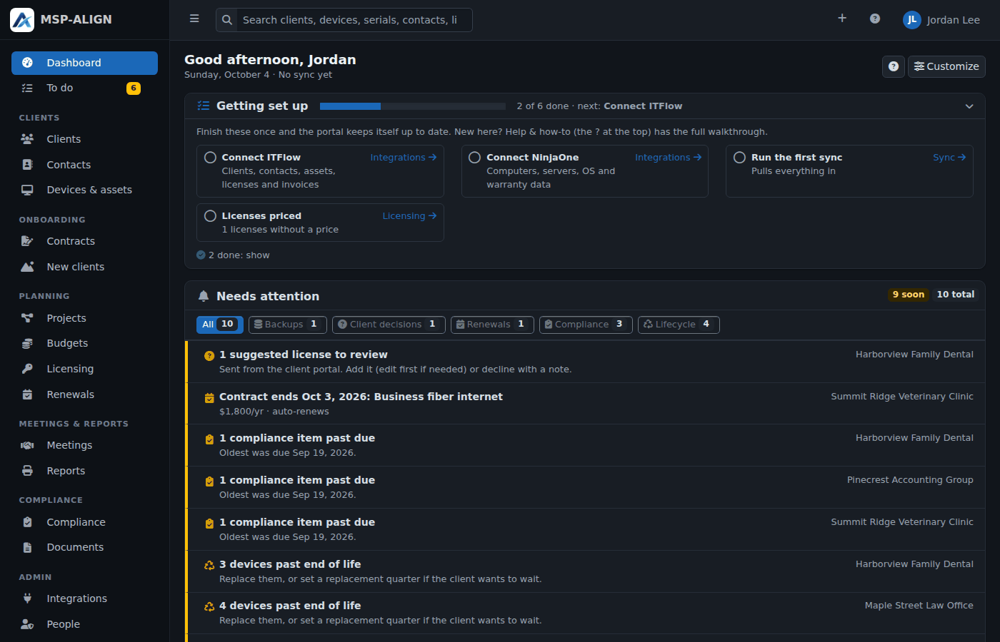

## A client

The client overview: the planning checklist, lifecycle numbers, the three-year plan, meetings and backups.

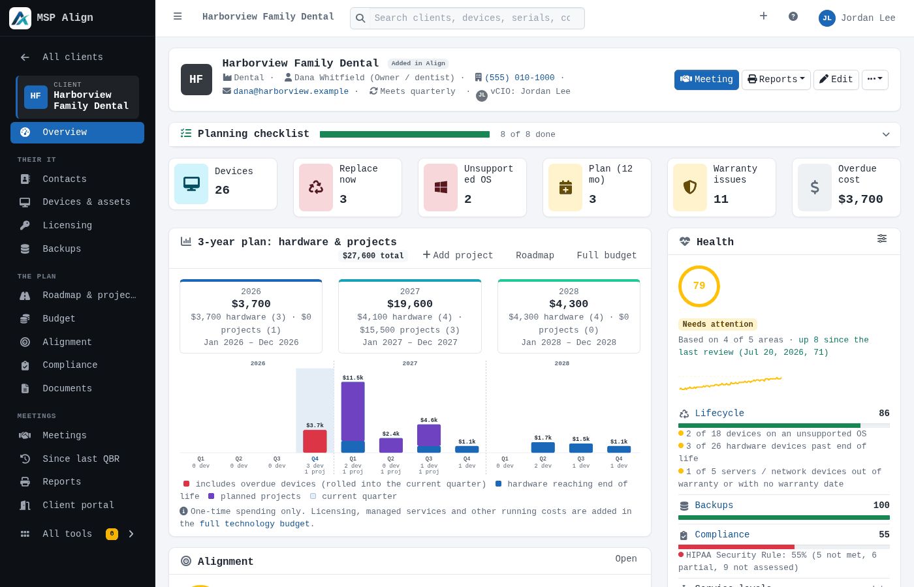

### Roadmap & projects

Everything that lands in the next three years, by quarter: your projects plus hardware end of life, OS end of support,
warranties, meetings and compliance due dates. Drag projects and devices to another quarter.

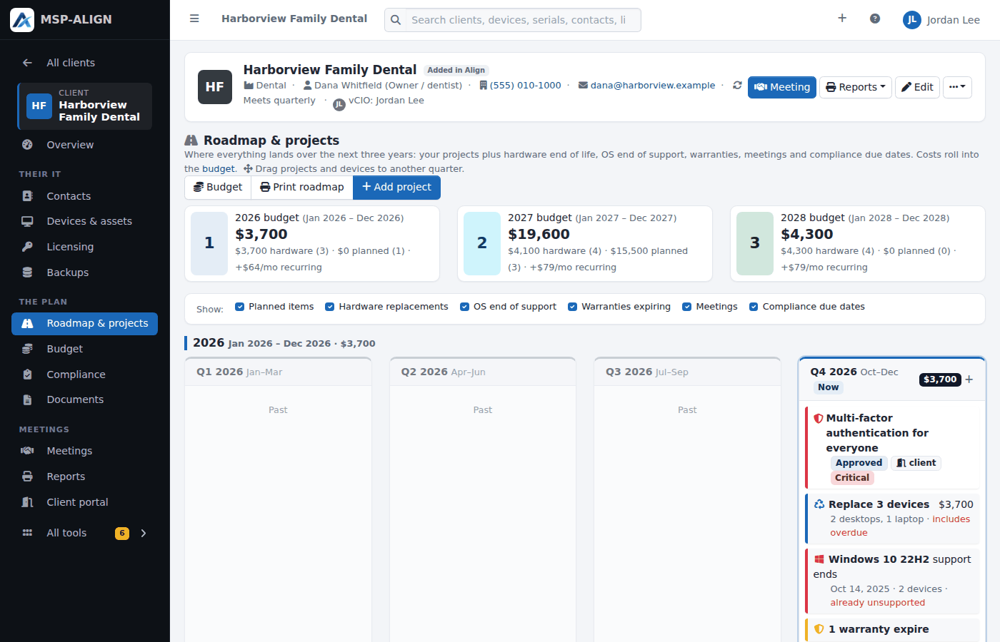

### Alignment

How the client measures against your own standards (Settings → Standards): the score and its trend, each category,
and the gaps in order of importance, each one a roadmap project in one click.

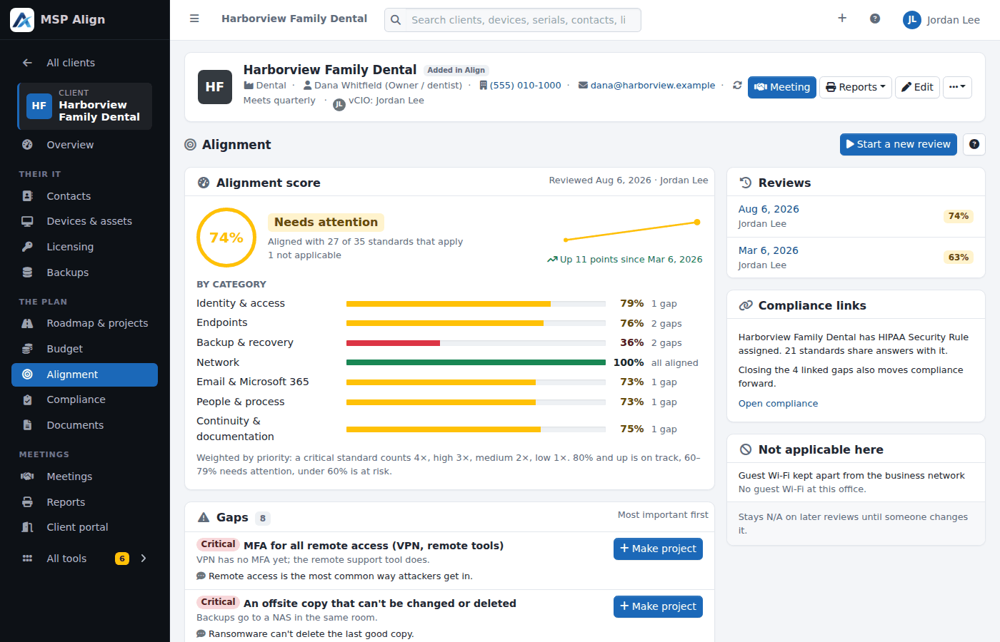

### Technology budget

A three-year budget by quarter that builds itself from licensing, hardware replacements, projects and managed services,
plus any lines you add.

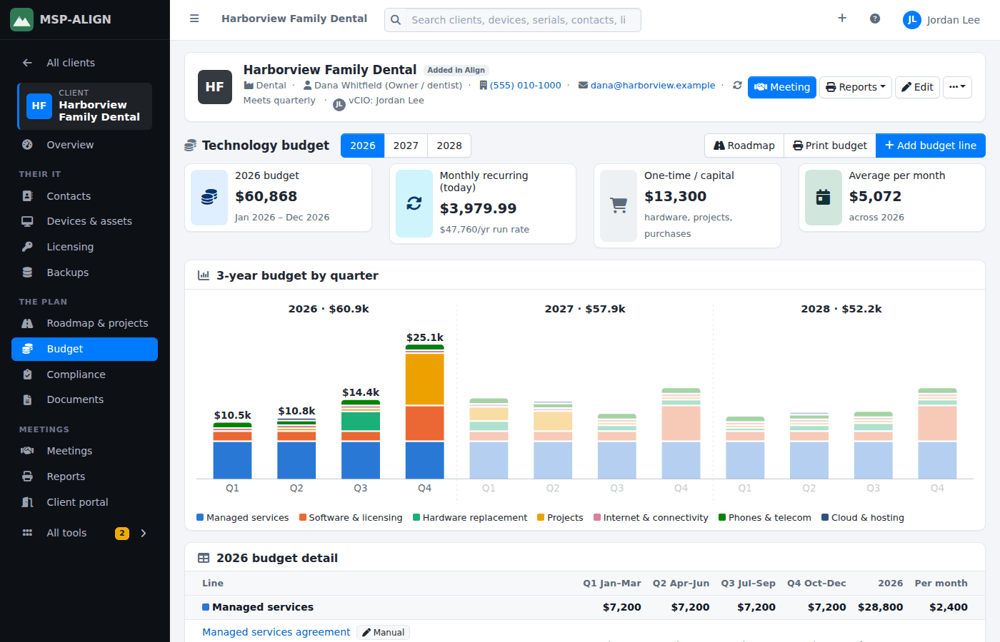

### Devices & assets

Every computer, server and network device with its age, end of life and status, from your PSA and RMM or added by hand.

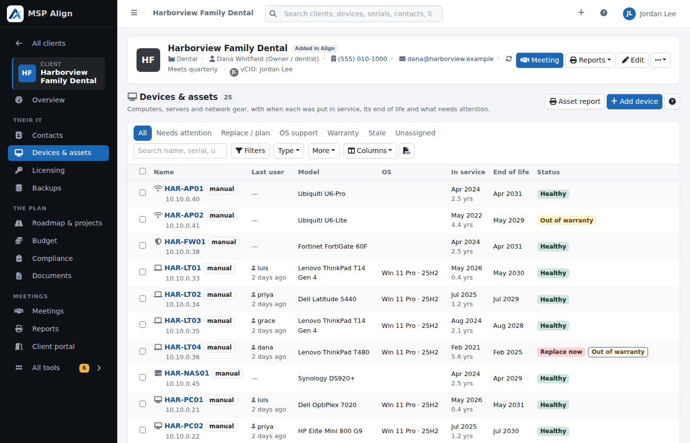

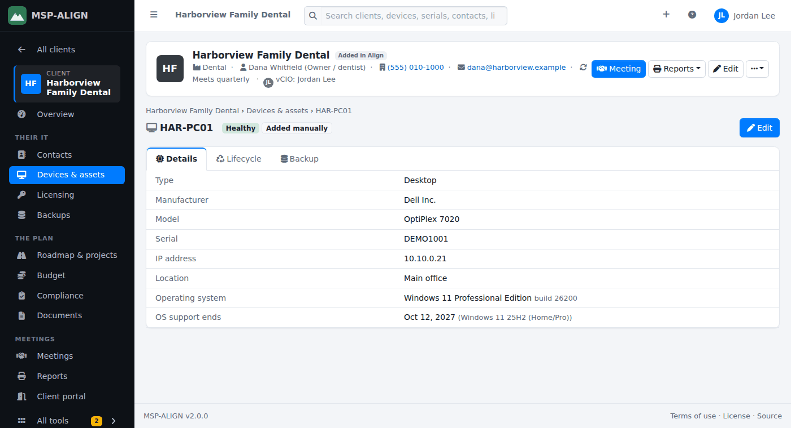

### Licensing

Licenses from your PSA with prices, billing cycles and renewal dates kept in MSP Align.

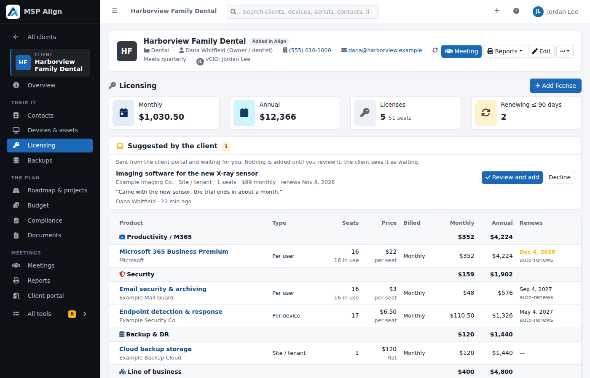

### Compliance

Checklists for HIPAA, CIS Controls, NIST CSF, CMMC, PCI DSS, ISO 27001, SOC 2 and more, with owners, due dates, notes and evidence.

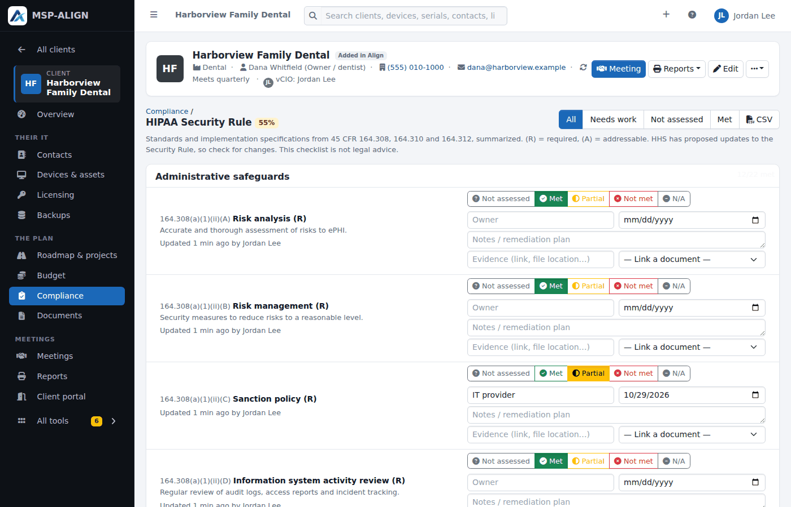

### Meetings

Business reviews and internal prep meetings on a cadence per client, with calendar invitations.

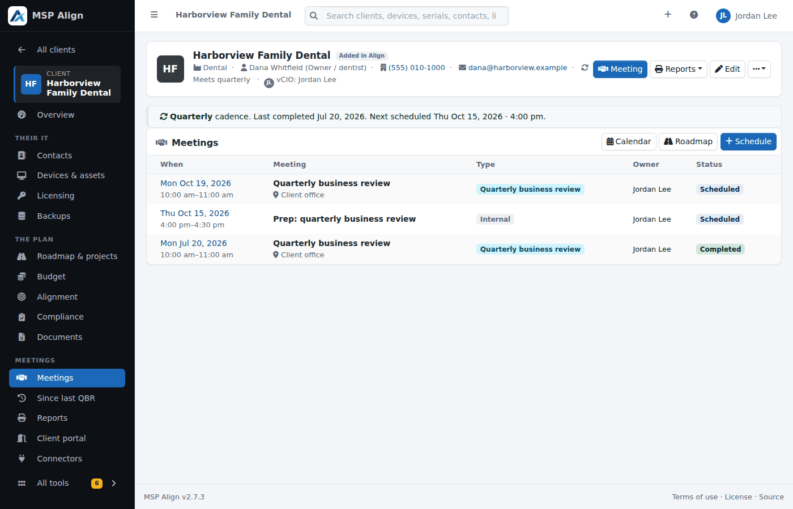

## Reports

Printable, client-ready reports (Print → Save as PDF): the business review pack, service levels, assets and lifecycle,
backup and recovery, the roadmap, the budget and policies, plus CSV exports.

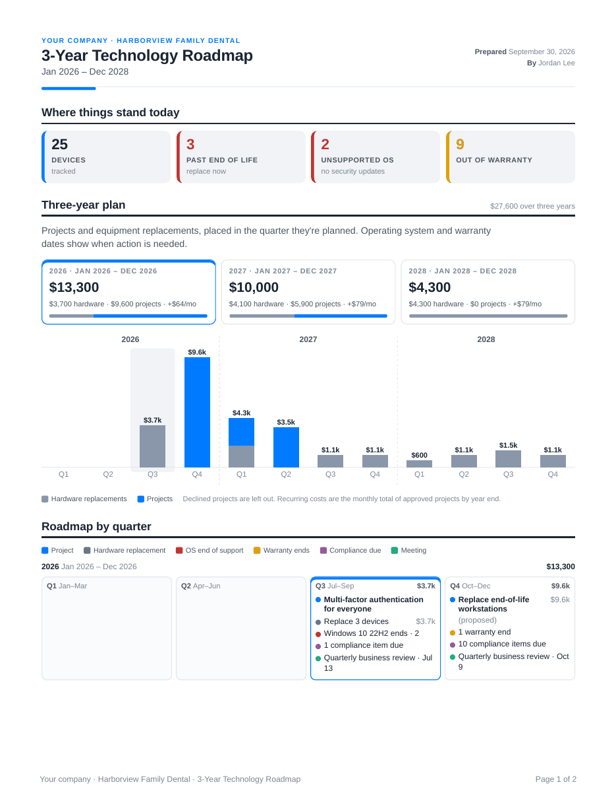

## To do and integrations

**To do** lists the setup and upkeep waiting on your team; **Integrations** shows each connected tool and its status.

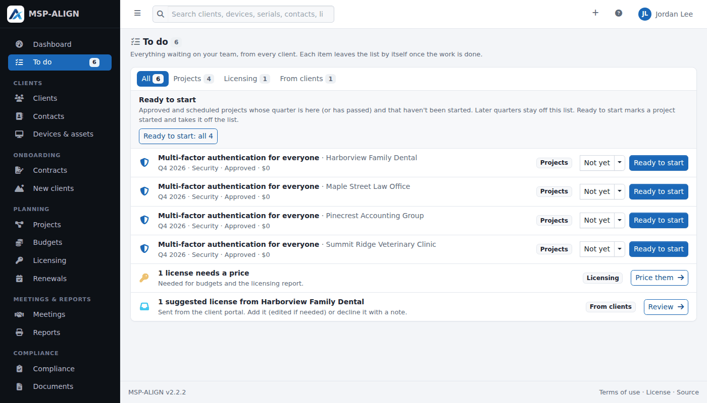

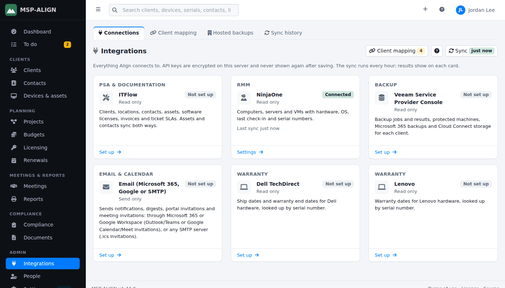

## The client portal

What your clients see: decisions waiting on them, their plan and budget, their devices, compliance and meetings, with
their logo at the top. Every section is optional per portal user.

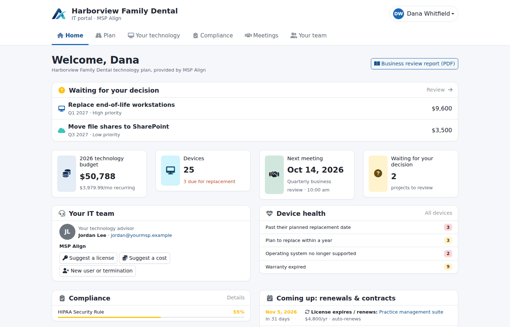

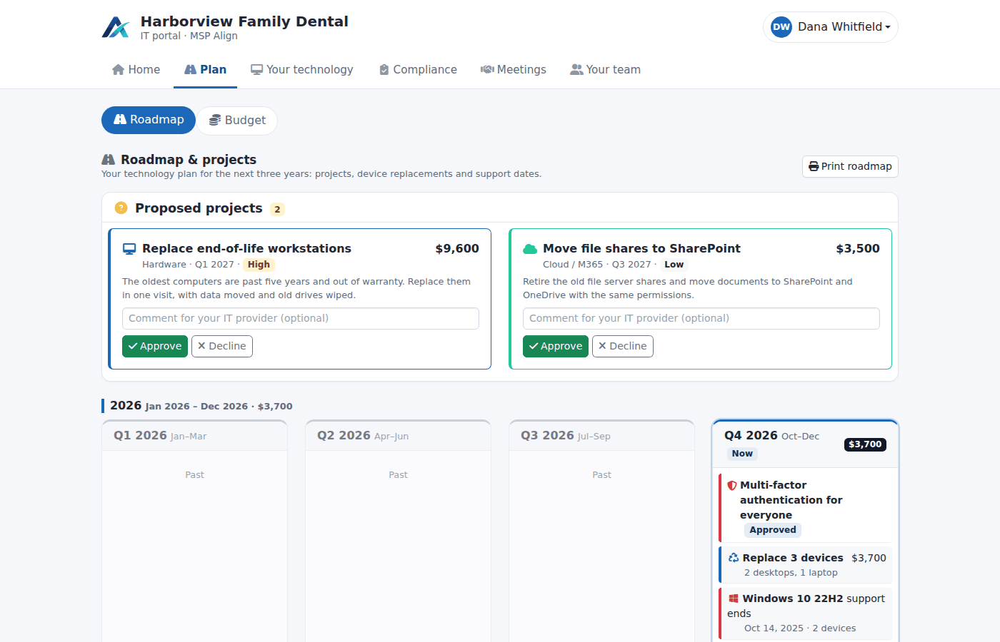

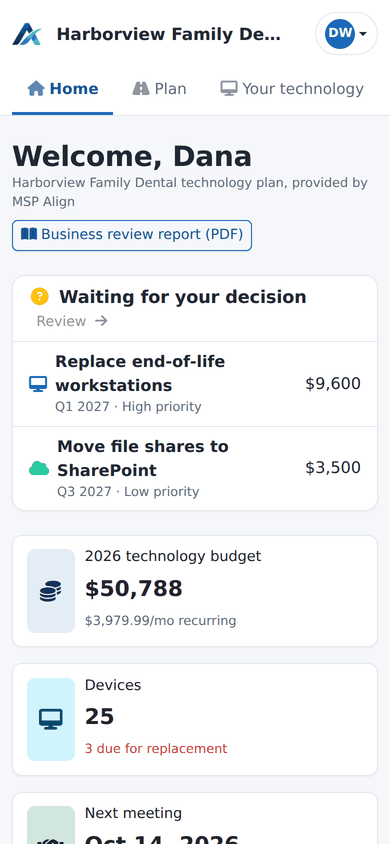
